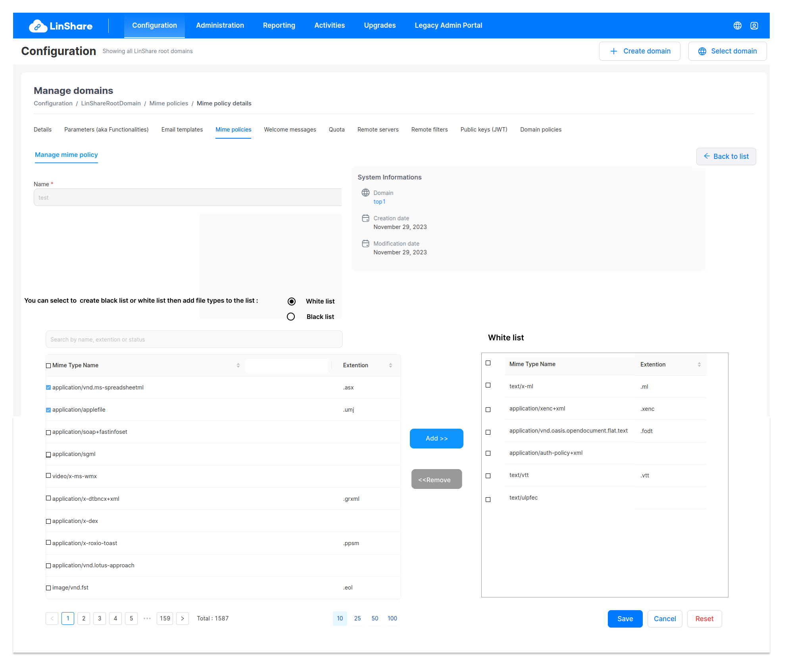

# Summary

* [Related EPIC](#related-epic)
* [Definition](#definition)
* [Screenshots](#screenshots)
* [Misc](#misc)

## Related EPIC

* [New admin portal](./README.md)

## Definition

#### Preconditions

- Given that i am super-admin/nested admin in LinShare 
- I logged-in to Admin portal successfully
- I select a domain in Domain tree and go to Configuration tab on top navigation bar
- I click on Mime policies, the screen Mine policies listing list will be opened.
- If i am selecting root domain in domain tree, i can see the list of mime policies that i created. They can be used for any lower-level domains.
- If i am selecting a nested domain in the domain tree, i can see the list of mime policies that i created and the mime policies from higher level domain. 

#### Description

**UC1. Create an mime policy**
- On Mime policies listing screen, i can click on create button 
- The screen Create mime policy will be displayed.

   - Name: a text field and mandatory
   - The non-editable fields incude:
      - Domain
      - Creation date
- I input name and click button Create => the mime policy is created 

**UC2. Add white-list/Black list for mime policy**.

- If i am super-admin, i can edit all mime policies
- If i am nested admin, i can only edit the mime policies created by me and my lower-level domain
- There are 2 ways to access Edit mime policy screen:
   - In the Mime policy listing screen, i click on three dot-button of a Mime policy and select option Detail from the drop-down list
   - Or i can click an the  mime policy row on the mime policy listing table. 
- By default, the Mime policy detail screen will be in View mode
- If i have permission to Edit, there will be button Edit, i click on this button, the Edit mode will be enable. 

- On the mime policy screen, below "Name" and "System information", I can see a text: "You can select to  create black list or white list then add file types to the list" , and radio buttons for Blacklist or White list. 

- On the left table i can see list of all mime types 
      - Mime types: Name of the mime type
      - Extention: the extention of the mime type

- If I select radio button "Black list" , the table on the right will be blacklist table: All mime types on blacklist table will be blocked, and the remaining mime types are authorized.
- If I select radio button "White list", he table on the right will be whitelist table: All mime types on whitelist table will be authorized, and the remaining mime types are blocked.

- After a mime policy is created successfully, by default blacklist option is selected and there is no mime types in blacklist table - which means that all mime types are authorized. 

- I can add/remove mime types from left table to the blacklist/whitelist table on the right by 2 ways:

1. I can select checkbox of mime types on left table, then click button "Add" , then they will be moved to the right table. If I want to remove mime type from blacklist/white list, I can select checkbox of mime types on right table then click button "Remove", then they will be moved to left table. 
2. I can drag and drop mime type between 2 tables 

- When I click Save, the mime policy is updated with blacklist/white list.

#### Postconditions

[Back to Summary](#summary)

## UI Design

#### Mockups

#### Final design

[Back to Summary](#summary)
## Misc

[Back to Summary](#summary)

